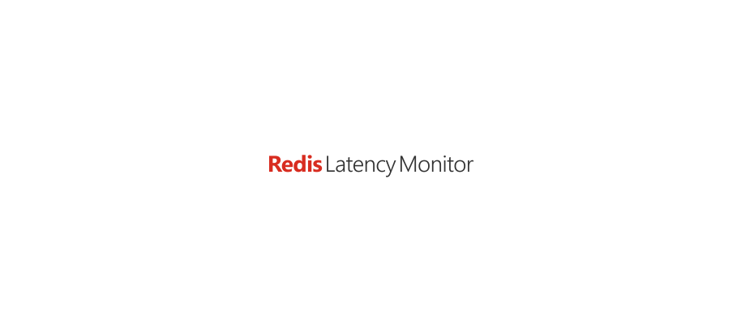

<p align="center"><a href="#readme"></a></p>

<p align="center">
  <a href="https://kaos.sh/w/redis-latency-monitor/ci"></a>
  <a href="https://kaos.sh/r/redis-latency-monitor"></a>
  <a href="https://kaos.sh/w/redis-latency-monitor/codeql"></a>
  <a href="#license"></a>
</p>

<p align="center"><a href="#usage-demo">Usage demo</a> • <a href="#installation">Installation</a> • <a href="#usage">Usage</a> • <a href="#ci-status">CI Status</a> • <a href="#license">License</a></p>

<br/>

Tiny Redis client for latency measurement. Utility show `PING` command latency or connection latency in milliseconds (_one thousandth of a second_).

### Usage demo

[](#usage-demo)

### Installation

#### From source

To build the `redis-latency-monitor` from scratch, make sure you have a working [Go 1.23+](https://github.com/essentialkaos/.github/blob/master/GO-VERSION-SUPPORT.md) workspace (_[instructions](https://go.dev/doc/install)_), then:

```
go install github.com/essentialkaos/redis-latency-monitor@latest
```

#### From [ESSENTIAL KAOS Public Repository](https://kaos.sh/kaos-repo)

```bash
sudo dnf install -y https://pkgs.kaos.st/kaos-repo-latest.el$(grep 'CPE_NAME' /etc/os-release | tr -d '"' | cut -d':' -f5).noarch.rpm
sudo dnf install redis-latency-monitor
```

#### Prebuilt binaries

You can download prebuilt binaries for Linux and macOS from [EK Apps Repository](https://apps.kaos.st/redis-latency-monitor/latest).

### Usage


### CI Status

| Branch | Status |
|--------|--------|
| `master` | [](https://kaos.sh/w/redis-latency-monitor/ci?query=branch:master) |
| `develop` | [](https://kaos.sh/w/redis-latency-monitor/ci?query=branch:develop) |

### License

[Apache License, Version 2.0](https://www.apache.org/licenses/LICENSE-2.0)

<p align="center"><a href="https://essentialkaos.com"></a></p>
